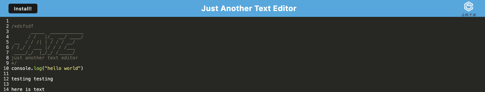

<h1 id="title">ReadMe file for "A Unique PWA Text Editor"</h1>
<h3>By User davehyler</h3>
<!-- Optional Screenshot will show if user places one within the same directory as this readme. -->

 
<nav>
<h2>Table Of Contents</h2>
<ol>
<li><a href="#title">Title</a></li>
<li><a href="#username">Username</a></li>
<li><a href="#email">Email</a></li>
<li><a href="#stack">Stack</a></li>
<li><a href="#license">License</a></li>
<li><a href="#description">Description</a></li>
<li><a href="#instructions">Instructions</a></li>
<li><a href="#usage">Usage</a></li>
<li><a href="#guidelines">Guidelines</a></li>
<li><a href="#testing">Testing</a></li>
</ol>
</nav>
<ul class="list-group">
<h2>Project Information</h2>
<h3 id="stack">Stack used:</h3>

HTML,JavaScript,CSS

<h3 id="license">License: MIT</h3>

Badge: 

<h3 id="description">Description of project:</h3>

This is a simple Progressive Web Application based Text-Editor

<h3 id="instructions">Instructions:</h3>
Step 1: Clone the repository on this page

Step 2: Install the dependencies:
Install the dependencies for BOTH the folders "client" and "server"

Step 2A
cd client
npm install

Step 2B
cd ../server
npm install

Step 3: Build the WebPack
cd client
npm run build

Step 4: Start the Server:
cd ../server
npm start

You should now be able to access the fully working Text Editor at your Local Address of 3000: http://localhost:3000/
<h3 id="usage">From the source readme:</h3>

-GIVEN a text editor web application 
-WHEN I open my application in my editor 
-THEN I should see a client server folder structure 
-WHEN I run `npm run start` from the root directory 
-THEN I find that my application should start up the backend and serve the client 
-WHEN I run the text editor application from my terminal 
-THEN I find that my JavaScript files have been bundled using webpack 
-WHEN I run my webpack plugins 
-THEN I find that I have a generated HTML file, service worker, and a manifest file 
-WHEN I use next-gen JavaScript in my application 
-THEN I find that the text editor still functions in the browser without errors 
-WHEN I open the text editor 
-THEN I find that IndexedDB has immediately created a database storage 
-WHEN I enter content and subsequently click off of the DOM window 
-THEN I find that the content in the text editor has been saved with IndexedDB 
-WHEN I reopen the text editor after closing it 
-THEN I find that the content in the text editor has been retrieved from our IndexedDB 
-WHEN I click on the Install button 
-THEN I download my web application as an icon on my desktop 
-WHEN I load my web application 
-THEN I should have a registered service worker using workbox 
-WHEN I register a service worker 
-THEN I should have my static assets pre cached upon loading along with subsequent pages and static assets 
-WHEN I deploy to Render 
-THEN I should have proper build scripts for a webpack application 

<h3 id="guidelines">Guidelines for Contribution:</h3>

To contribute, please upload your code or alterations to a commit and it will be reviewed.

<h3 id="testing">Tests</h3>

N/A. If you would like to write a test for these functions, feel free.

</ul>
<h3>Questions? Contact Me:</h3>
<ul class="list-group">
<li class="list-group-item" id="username">GitHub username: davehyler</li>
<li class="list-group-item" id="email">Email:  davehyler@github.com (placeholder since this is a publicly accessible and scrapable page)</li>
</ul>
<a href = "https://davehyler.github.io/UniqueTasks">Launch Task Manager Application Here</a>

